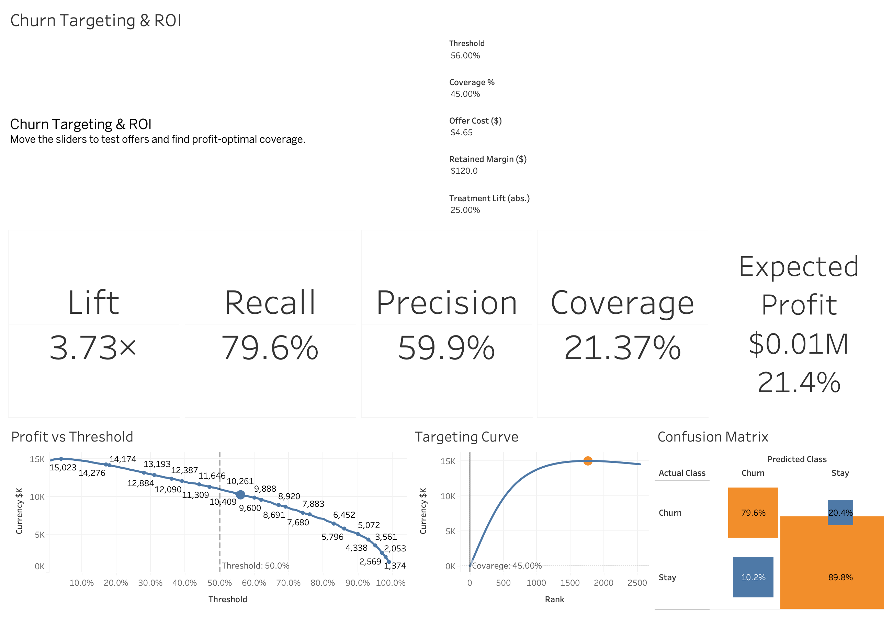
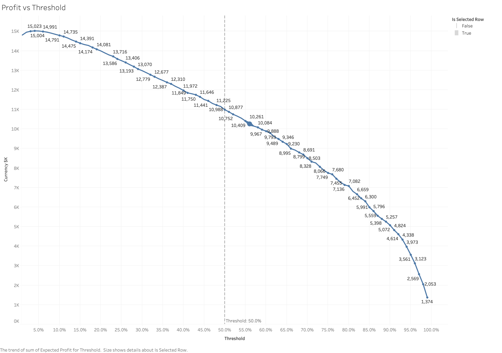
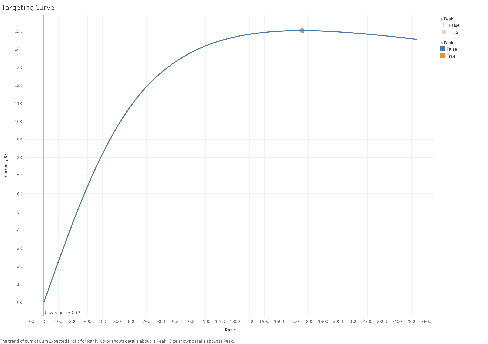
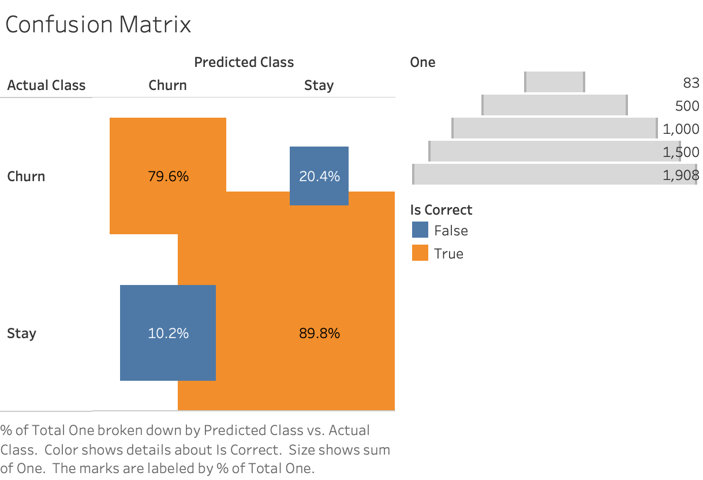
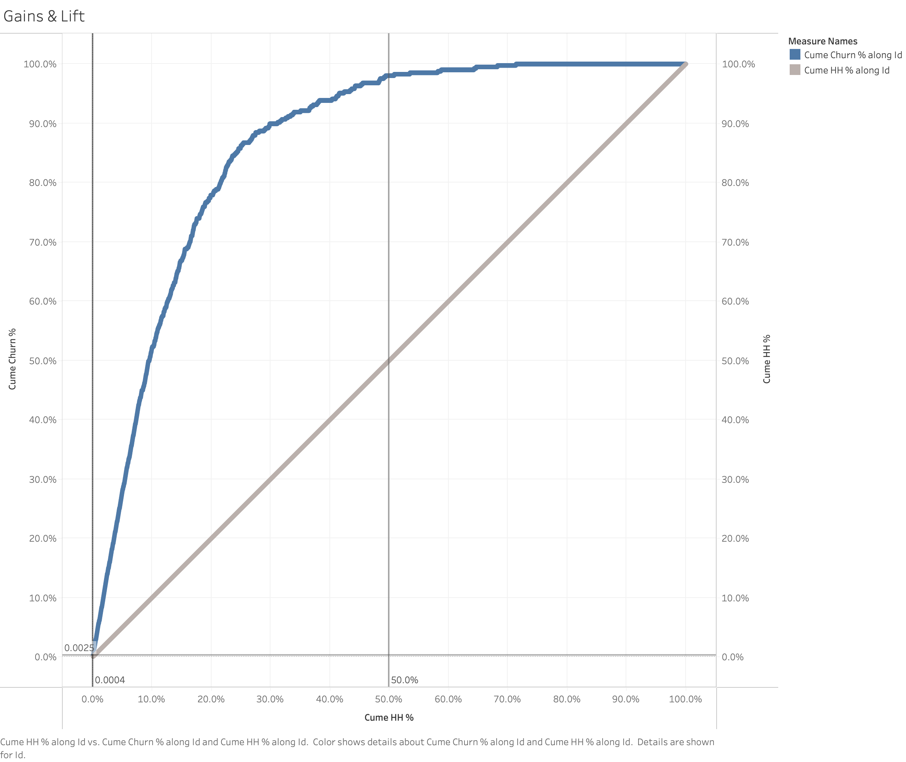

# Churn Targeting & ROI (BankChurners)

**Goal:** turn churn predictions into profit-optimal targeting.

This repo trains a calibrated churn model on the BankChurners dataset, simulates campaign ROI with tunable economics, and ships a Tableau one-pager where you can slide Threshold / Coverage / Offer / Margin / Lift and instantly see Expected Profit, Confusion Matrix, and the Targeting Curve peak.

## 🔎 What's inside

### Modeling
- Rigorously preprocessed BankChurners data
- Train/test split, class-imbalance handling
- Logistic baseline (+ optional XGBoost) with probability calibration
- Metrics: ROC-AUC, PR-AUC, Brier, precision/recall, F1, specificity
- Feature importance (SHAP if available, else permutation)

### ROI Simulation
- **Per-HH Expected Profit:**
  \[
  \text{EP}_i = p_i \times \text{Lift} \times \text{Retained Margin} - \text{Offer Cost}
  \]
- Coverage control (cap how many HH you target by expected profit)
- Profit vs Threshold curve and Targeting Curve (ranked by EP)

### Tableau Storyboard (one page)
- KPI tiles: Lift, Recall, Precision, Coverage, Expected Profit
- Profit vs Threshold (with adjustable threshold line)
- Targeting Curve (peak indicator = stop point)
- Confusion Matrix at the current threshold
- Parameter controls (Threshold, Coverage %, Offer $, Retained Margin $, Treatment Lift)

## 🗂️ Repo structure
```
.
├── data/
│   ├── raw/                     # Place BankChurners.csv here
│   └── processed/               # Cleaned/encoded files written by notebooks
├── docs/
│   └── data_dictionary.md       # Human-friendly field dictionary and notes
├── notebooks/
│   ├── 01_data_prep.ipynb       # Clean → train/test split → export processed
│   ├── 02_churn_modeling.ipynb  # Train + calibrate + export customer_scored.csv
│   └── 03_roi_simulation.ipynb  # ROI curves, targeting table, exports
├── outputs/
│   ├── profit_vs_threshold.png
│   ├── targeting_curve.png
│   ├── confusion_matrix.png
│   ├── gains_lift.png           # optional
│   └── shap_summary.png         # optional (if SHAP available)
├── tableau/
│   ├── Churn_Targeting_ROI.twbx
│   ├── customer_scored.csv                  # model scores + flags
│   ├── threshold_curve.csv                  # (threshold, expected_profit, coverage)
│   └── shap_importance.csv                  # optional (feature importance)
├── requirements.txt
├── LICENSE
└── README.md
```

**Data location:** download BankChurners.csv and place it in `data/raw/BankChurners.csv`.

## ⚙️ Setup

- Python 3.10+ (tested)

```bash
# create & activate a venv (example)
python -m venv .venv
source .venv/bin/activate  # Windows: .venv\Scripts\activate

# install deps
pip install -r requirements.txt

# optional extras (for stronger model + explainability)
pip install xgboost shap
```

## ▶️ Reproduce end-to-end

### 1. Prep data
**Run:** `notebooks/01_data_prep.ipynb`
- cleans columns, encodes categoricals, exports processed tables to `data/processed/`

### 2. Train + Score + Calibrate
**Run:** `notebooks/02_churn_modeling.ipynb`
- trains logistic (and optional XGBoost), calibrates probabilities
- exports `tableau/customer_scored.csv` with:
  - `p_churn`, `predicted`, and confusion-matrix flags TP/FP/FN/TN
  - helper fields (rank, gains/lift accumulators)

### 3. ROI Simulation
**Run:** `notebooks/03_roi_simulation.ipynb`
- computes Expected Profit per HH, Profit vs Threshold, Targeting Curve
- exports `tableau/threshold_curve.csv` (and optional screenshots to `outputs/`)
- optional: `tableau/shap_importance.csv`

### 4. Open the dashboard
**Launch:** `tableau/Churn_Targeting_ROI.twbx`
- Use the sliders to explore Threshold, Coverage %, Offer $, Margin $, and Lift

## 🧭 How to use the Tableau page

- **Threshold** — moves the classification cut-off; changes precision/recall & confusion matrix.
- **Coverage %** — caps the top N% of households by Expected Profit (prevents over-targeting).
- **Offer Cost ($)** — per-message/offer cost.
- **Retained Margin ($)** — net margin retained if a churning customer is saved.
- **Treatment Lift (abs.)** — expected absolute lift in conversion from your action.

### Reads & visuals
- **KPI tiles:** Lift, Recall, Precision, Coverage, Expected Profit (live at selected parameters).
- **Profit vs Threshold:** shows where expected profit peaks across thresholds (dashed line = current threshold).
- **Targeting Curve:** cumulative expected profit as you include more households by EP; peak dot = profit-optimal stop.
- **Confusion Matrix:** at the current threshold (precision/recall trade-off).

## 📸 Screenshot preset (so your images match mine)

Put these values in Tableau before exporting screenshots to `outputs/`:

| Parameter | Value |
|-----------|-------|
| Threshold | 56% |
| Coverage % | 45% |
| Offer Cost ($) | 4.65 |
| Retained Margin ($) | 120 |
| Treatment Lift (abs.) | 0.25 |

**Expected snapshot (approx.)**  
Lift ≈ 3.7–4.1× · Precision ≈ 59–61% · Recall ≈ 75–80% · Coverage ≈ 18–22% · Expected Profit ≈ $0.01M

> ✅ Update here if you change any ROI assumptions (cost, margin, lift) or re-tune the model.

## Results (selected visuals)

<p align="center">
  <br>
  <em>KPI scoreboard at current parameters.</em>
</p>

<p align="center">
  <br>
  <em>Profit vs Threshold - pick the threshold at the peak.</em>
</p>

<p align="center">
  <br>
  <em>Targeting Curve - stop where the curve peaks (profit-optimal coverage).</em>
</p>

<p align="center">
  
  &nbsp;&nbsp;
  
  <br><em>Diagnostics at the chosen threshold.</em>
</p>

<!-- If you exported importance instead of kpi_strip, swap this in: -->
<!-- <p align="center">
  
  <br><em>Top drivers of the model’s predictions.</em>
</p> -->


## 🧠 Modeling notes

### Why logistic + calibration?
Simple, stable baseline whose probabilities become well-calibrated (isotonic fallback to sigmoid). That makes ROI math meaningful.

### Class imbalance
Uses class weights; PR-AUC and precision/recall reported at selectable threshold.

### Feature importance
If xgboost + shap are installed, we compute SHAP global importance; otherwise we use permutation importance and export the top features.

## 📈 ROI & targeting methodology

**Per household EP:**
\[
p_i \times \text{Lift} \times \text{Margin} - \text{Cost}
\]

- **Coverage** enforces a budget/targeting cap: include only the top-EP households up to X%.
- Pick the stop point where the **Targeting Curve** peaks. Beyond that, marginal EP turns negative.
- **Profit vs Threshold** helps you choose a balanced threshold before applying coverage caps.

## 🧪 Experiment (A/B) to validate lift

- **Primary metric:** 30-day conversion / retention.
- **Guardrails:** margin per send, unsubscribe/complaint rate.
- **Design:** randomized within the target; fixed horizon; pre-declared success criteria.
- **Sample size:** computed in `03_roi_simulation.ipynb` (two-proportion test; α=0.05, power=0.8).
- **Rollout:** start with the top N% by EP; expand if results are robust.

## 📄 Known limitations & next steps

- BankChurners is a public, anonymized dataset; treat insights as methodological.
- If silhouettes/lift are modest, use segments as operational cohorts, not personas.

**Next iterations:**
- Category/behavioral features (ratios, tenure velocity)
- CLV modeling (BG/NBD + Gamma–Gamma)
- Uplift modeling after real-world experiments
- Cost-aware hyperparameter tuning (optimize PR-AUC at business threshold)

## 🔧 Troubleshooting

- **"XGBoost/SHAP not installed"** — the notebooks will fall back to logistic + permutation importance.
- **NumPy 2.x binary errors** — pin `numpy<2` or upgrade affected packages to versions compiled for 2.x.
- **Tableau parameters not visible** — in the Dashboard, use the sheet menu "Parameters → Show Parameter" for each knob (Threshold, Coverage %, Offer $, Retained Margin $, Treatment Lift).

## 📬 Contact

**Toan Le**  
- 📧 Email: [nguyenphutoanle@gmail.com](mailto:nguyenphutoanle@gmail.com?subject=Customer%20Segmentation%20%26%20ROI%20Playbooks%20%28dunnhumby%29%20%F0%9F%93%8A)
- 💼 LinkedIn: https://www.linkedin.com/in/toanle02/  
- 🧑‍💻 GitHub: https://github.com/Twon02  

**Questions about this project? Please open an **Issue** in this repo instead of emailing—this keeps discussion transparent and searchable.**

*This project is for educational/portfolio use only — not investment advice.*